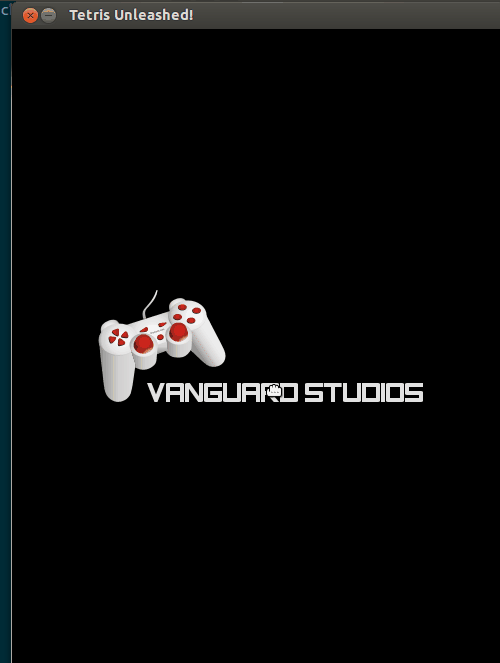
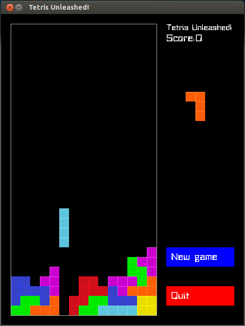

Tetris Unleashed!
================

Tetris clone written in C++ with SDL 2.0.

## Installation

### Ubuntu

You will need to download and install: 

+ [SDL 2.0](http://www.libsdl.org/)
+ [SDL ttf 2.0](http://www.libsdl.org/projects/SDL_ttf/)
+ [SDL image 2.0](https://www.libsdl.org/projects/SDL_image/)

Then, just type `make` to compile.

### OS X

1. Install [Homebrew](http://brew.sh/).
2. Type `make` to install libraries and compile.

## Run the game

To run the game, type `./tetris`.

## How to play

Up Arrow/W      -> rotates the current tetromino

Left Arrow/A    -> moves the current tetromino to the left

Right Arrow/D   -> moves the current tetromino to the right

Down Arrow/S    -> speeds up the current tetromino

Spacebar        -> zooms the current tetromino to the bottom

New Game        -> starts new game

Quit            -> quits

## To-do

+ ~~Update code to SDL2~~
+ ~~Add fonts with SDL ttf~~
+ ~~Convert to OOP~~
+ ~~Add music~~
+ ~~Add menu screen~~
+ ~~Add tetrimino shadow~~
+ Add pause option
+ Add fullscreen option 
+ Add power-ups
+ Test on OS X
+ Add mouse control
+ Add joystic control

# Credits

Chafic Najjar - chafic.najjar@gmail.com

[irrKlang](http://www.ambiera.com/irrklang/index.html) for sound.

