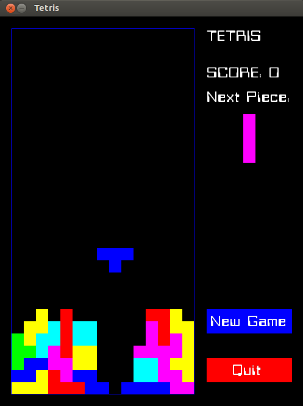

Tetris Unleashed!
================

Tetris clone based on [QuantumKing's](https://github.com/QuantumKing) deleted project.

## Installation

You will need SDL 1.2.13 and freetype.

## How to play

Up Arrow/W      -> rotates the current tetromino

Left Arrow/A    -> moves the current tetromino to the left

Right Arrow/D   -> moves the current tetromino to the right

Down Arrow/S    -> speeds up the current tetromino

Spacebar        -> zooms the current tetromino to the bottom

New Game        -> starts new game

Quit            -> quits

## To-do

+ Update code to SDL2
+ Add pause option

# Credits

This project is based on [QuantumKing's](https://github.com/QuantumKing) now deleted project. 

Restructuring and modifications by Chafic Najjar - chafic.najjar@gmail.com

